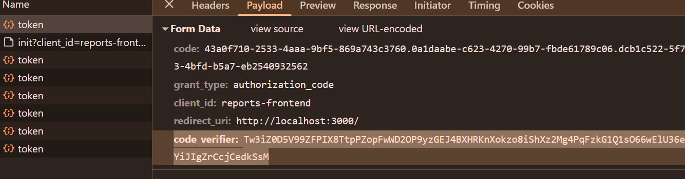
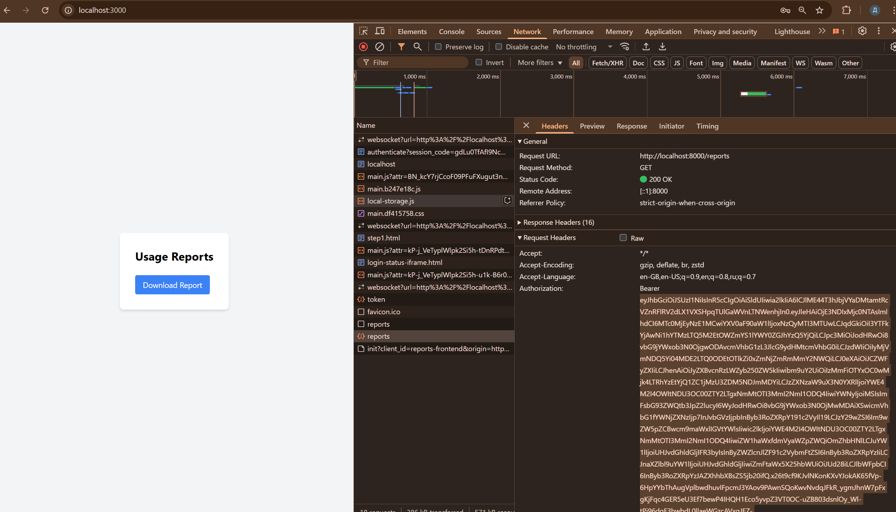
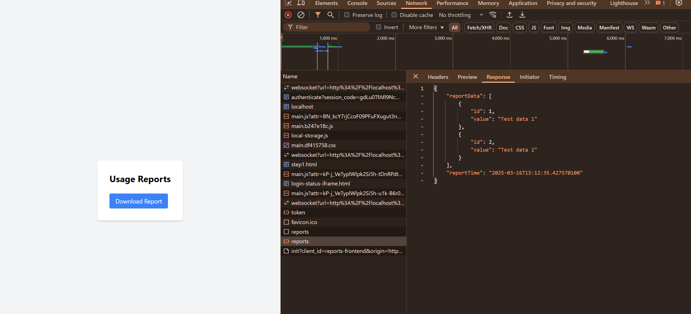
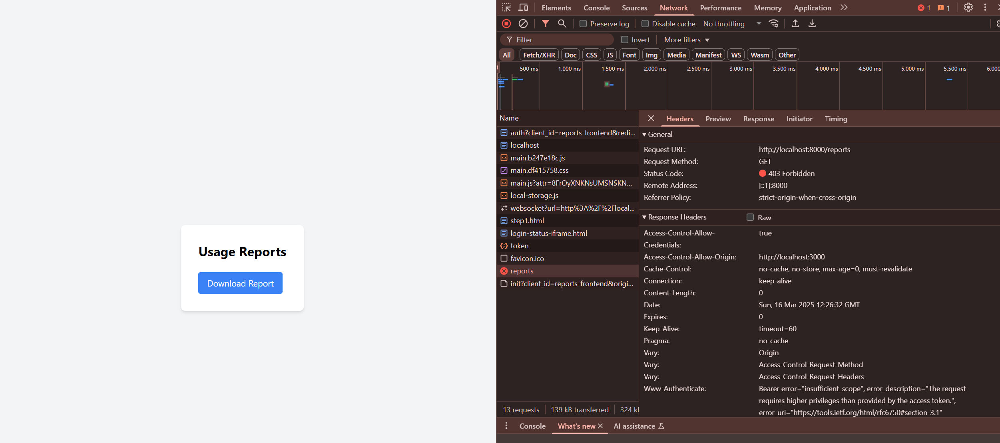

## После ревью 
Добрый день, Иван!
Прочитал замечание, да, все так, у меня не получилось все запустить в докер-композе.
Но результат есть, он в ниже в readme.

Джаву нужно запустить локально, а не в докер-композ, а с докер-композ не получается на винде, а линукс/вируталку не хочется запускать.

На работе завал, только сейчас смог вернуться. И следующая неделя будет жаркая.
Запуск в докер-композ обязательное условие для сдачи? Тема это безопасность, и у меня все получилось. Сети, а именно с ними у меня проблема, не относятся к теме, хотя я понимаю, что проверка выйдет неполной и другие участники довели до конца.

Повторюсь, для решения проблемы пробовал, но не получилось:
1) Заменить localhost на keycloak на фронте/админке.
2) Настроить network в docker-compose
3) Сделать прокси
4) Убрать на беке проверку iss

## Реализация PKCE
Добавил на фронт и в файлик keycloak/realm-export.json

Приложил скриншот, PKCE.png. Добавился code_verifier.

## Создание бэкенд-часть приложения для API
Реализовал на языке java 17.

Но возникла проблема с docker-compose, из-за http://localhost:8080/realms/reports-realm (src/main/resources/application.properties).
У меня не получается уже 2 дня настроить docker-compose так, чтобы все работало в 1 группе контейнеров.
Зато все работает, если java приложение запустить локально, не в контейнере. 
Я добавил файл API/Dockerfile.

Проблема в "iss" в JWT токене, если я на беке делаю http://keycloak:8080/realms/reports-realm, то iss JWT токена и бека не совпадают и аунтификация не проходит.

### Поэтому, если нужно запустить все приложение, запустите, пожалуйста, бек отдельно, а docker-compose отдельно и все заработает. 
А то сегодня последний день, и так 2 дня бьюсь. Пробовал, но ничего не сработало:
1) Заменить localhost на keycloak на фронте/админке.
2) Настроить network в docker-compose
3) Сделать прокси
4) Убрать на беке проверку iss

## Вот результаты работы, если запустить бек не в контейнере:
### Пользователь prothetic2

JWT токен:
eyJhbGciOiJSUzI1NiIsInR5cCIgOiAiSldUIiwia2lkIiA6ICJlME44T3hJbjVYaDMtamtRcVZnRFlRV2dLX1VXSHpqTUlGaWVnLTNWenhjIn0.eyJleHAiOjE3NDIxMjc0NTAsImlhdCI6MTc0MjEyNzE1MCwiYXV0aF90aW1lIjoxNzQyMTI3MTUwLCJqdGkiOiI3YTFkYjAwNi1hYTMzLTQ5M2EtOWZmYS1lYWY0ZGJhYzQ5YjQiLCJpc3MiOiJodHRwOi8vbG9jYWxob3N0OjgwODAvcmVhbG1zL3JlcG9ydHMtcmVhbG0iLCJzdWIiOiIyMjVmNDQ5Yi04MDE2LTQ0ODEtOTlkZi0xZmNjZmRmMmY2NWQiLCJ0eXAiOiJCZWFyZXIiLCJhenAiOiJyZXBvcnRzLWZyb250ZW5kIiwibm9uY2UiOiIzMmFiOTYxOC0wMjk4LTRhYzEtYjQ1ZC1jMzU3ZDM5NDJmMDYiLCJzZXNzaW9uX3N0YXRlIjoiYWE4M2I4OWItNDU3OC00ZTY2LTgxNmMtOTI3MmI2NmI1ODQ4IiwiYWNyIjoiMSIsImFsbG93ZWQtb3JpZ2lucyI6WyJodHRwOi8vbG9jYWxob3N0OjMwMDAiXSwicmVhbG1fYWNjZXNzIjp7InJvbGVzIjpbInByb3RoZXRpY191c2VyIl19LCJzY29wZSI6Im9wZW5pZCBwcm9maWxlIGVtYWlsIiwic2lkIjoiYWE4M2I4OWItNDU3OC00ZTY2LTgxNmMtOTI3MmI2NmI1ODQ4IiwiZW1haWxfdmVyaWZpZWQiOmZhbHNlLCJuYW1lIjoiUHJvdGhldGljIFR3byIsInByZWZlcnJlZF91c2VybmFtZSI6InByb3RoZXRpYzIiLCJnaXZlbl9uYW1lIjoiUHJvdGhldGljIiwiZmFtaWx5X25hbWUiOiJUd28iLCJlbWFpbCI6InByb3RoZXRpYzJAZXhhbXBsZS5jb20ifQ.x26t9cf9KJvlNKonKXvYJokAK65fVp-6HpYYbThAugVplbwdhuvIFpcmJ3YAov9PAwnSQoKwvNvdqJFkR_ygmJhnW7pFxgKjFqc4GER5eU3Ef7bewP4IHQH1Eco5yvpZ3VT0OC-uZB803dsnlOy_Wl-tPj96dqF3hwbdL0llaeWGzcAVxqJEZ-Ovt9B9QD9m1i5qPvVekKbxhH0bKWAZVT82_Zalj2U7OkRDZApMOmd9QQcbV9OKmD0DFOmVEGaCa9QBl4XdYrTsyal3OCSGFx-8ONGr5Zydiw1vTjXmagZ9W421kVxd3pcnxW5ULU5fJxsNWl-dei3LM3_SSMGygw

Лог в режиме TRACE:
- 2025-03-16T15:12:35.198+03:00 DEBUG 21276 --- [API] [nio-8000-exec-1] o.s.security.web.FilterChainProxy        : Securing OPTIONS /reports
- 2025-03-16T15:12:35.198+03:00 TRACE 21276 --- [API] [nio-8000-exec-1] o.s.security.web.FilterChainProxy        : Invoking DisableEncodeUrlFilter (1/12)
- 2025-03-16T15:12:35.198+03:00 TRACE 21276 --- [API] [nio-8000-exec-1] o.s.security.web.FilterChainProxy        : Invoking WebAsyncManagerIntegrationFilter (2/12)
- 2025-03-16T15:12:35.201+03:00 TRACE 21276 --- [API] [nio-8000-exec-1] o.s.security.web.FilterChainProxy        : Invoking SecurityContextHolderFilter (3/12)
- 2025-03-16T15:12:35.201+03:00 TRACE 21276 --- [API] [nio-8000-exec-1] o.s.security.web.FilterChainProxy        : Invoking HeaderWriterFilter (4/12)
- 2025-03-16T15:12:35.204+03:00 TRACE 21276 --- [API] [nio-8000-exec-1] o.s.security.web.FilterChainProxy        : Invoking CorsFilter (5/12)
- 2025-03-16T15:12:35.214+03:00 TRACE 21276 --- [API] [nio-8000-exec-1] o.s.s.w.header.writers.HstsHeaderWriter  : Not injecting HSTS header since it did not match request to [Is Secure]
- 2025-03-16T15:12:35.220+03:00 TRACE 21276 --- [API] [nio-8000-exec-2] o.s.security.web.FilterChainProxy        : Trying to match request against DefaultSecurityFilterChain defined as 'securityFilterChain' in [class path resource [com/yandex/API/SecurityConfig.class]] matching [any request] and having filters [DisableEncodeUrl, WebAsyncManagerIntegration, SecurityContextHolder, HeaderWriter, Cors, Logout, BearerTokenAuthentication, RequestCacheAware, SecurityContextHolderAwareRequest, AnonymousAuthentication, ExceptionTranslation, Authorization] (1/1)
- 2025-03-16T15:12:35.220+03:00 DEBUG 21276 --- [API] [nio-8000-exec-2] o.s.security.web.FilterChainProxy        : Securing GET /reports
- 2025-03-16T15:12:35.220+03:00 TRACE 21276 --- [API] [nio-8000-exec-2] o.s.security.web.FilterChainProxy        : Invoking DisableEncodeUrlFilter (1/12)
- 2025-03-16T15:12:35.220+03:00 TRACE 21276 --- [API] [nio-8000-exec-2] o.s.security.web.FilterChainProxy        : Invoking WebAsyncManagerIntegrationFilter (2/12)
- 2025-03-16T15:12:35.220+03:00 TRACE 21276 --- [API] [nio-8000-exec-2] o.s.security.web.FilterChainProxy        : Invoking SecurityContextHolderFilter (3/12)
- 2025-03-16T15:12:35.220+03:00 TRACE 21276 --- [API] [nio-8000-exec-2] o.s.security.web.FilterChainProxy        : Invoking HeaderWriterFilter (4/12)
- 2025-03-16T15:12:35.220+03:00 TRACE 21276 --- [API] [nio-8000-exec-2] o.s.security.web.FilterChainProxy        : Invoking CorsFilter (5/12)
- 2025-03-16T15:12:35.222+03:00 TRACE 21276 --- [API] [nio-8000-exec-2] o.s.security.web.FilterChainProxy        : Invoking LogoutFilter (6/12)
- 2025-03-16T15:12:35.222+03:00 TRACE 21276 --- [API] [nio-8000-exec-2] o.s.s.w.a.logout.LogoutFilter            : Did not match request to Or [Ant [pattern='/logout', GET], Ant [pattern='/logout', POST], Ant [pattern='/logout', PUT], Ant [pattern='/logout', DELETE]]
- 2025-03-16T15:12:35.222+03:00 TRACE 21276 --- [API] [nio-8000-exec-2] o.s.security.web.FilterChainProxy        : Invoking BearerTokenAuthenticationFilter (7/12)
- 2025-03-16T15:12:35.225+03:00 TRACE 21276 --- [API] [nio-8000-exec-2] o.s.s.authentication.ProviderManager     : Authenticating request with JwtAuthenticationProvider (1/2)
- 2025-03-16T15:12:35.410+03:00 DEBUG 21276 --- [API] [nio-8000-exec-2] o.s.s.o.s.r.a.JwtAuthenticationProvider  : Authenticated token
- 2025-03-16T15:12:35.411+03:00 DEBUG 21276 --- [API] [nio-8000-exec-2] .s.r.w.a.BearerTokenAuthenticationFilter : Set SecurityContextHolder to JwtAuthenticationToken [Principal=org.springframework.security.oauth2.jwt.Jwt@360a6dcf, Credentials=[PROTECTED], Authenticated=true, Details=WebAuthenticationDetails [RemoteIpAddress=0:0:0:0:0:0:0:1, SessionId=null], Granted Authorities=[ROLE_prothetic_user]]
- 2025-03-16T15:12:35.411+03:00 TRACE 21276 --- [API] [nio-8000-exec-2] o.s.security.web.FilterChainProxy        : Invoking RequestCacheAwareFilter (8/12)
- 2025-03-16T15:12:35.411+03:00 TRACE 21276 --- [API] [nio-8000-exec-2] o.s.s.w.s.HttpSessionRequestCache        : matchingRequestParameterName is required for getMatchingRequest to lookup a value, but not provided
- 2025-03-16T15:12:35.411+03:00 TRACE 21276 --- [API] [nio-8000-exec-2] o.s.security.web.FilterChainProxy        : Invoking SecurityContextHolderAwareRequestFilter (9/12)
- 2025-03-16T15:12:35.412+03:00 TRACE 21276 --- [API] [nio-8000-exec-2] o.s.security.web.FilterChainProxy        : Invoking AnonymousAuthenticationFilter (10/12)
- 2025-03-16T15:12:35.412+03:00 TRACE 21276 --- [API] [nio-8000-exec-2] o.s.security.web.FilterChainProxy        : Invoking ExceptionTranslationFilter (11/12)
- 2025-03-16T15:12:35.412+03:00 TRACE 21276 --- [API] [nio-8000-exec-2] o.s.security.web.FilterChainProxy        : Invoking AuthorizationFilter (12/12)
- 2025-03-16T15:12:35.413+03:00 TRACE 21276 --- [API] [nio-8000-exec-2] estMatcherDelegatingAuthorizationManager : Authorizing GET /reports
- 2025-03-16T15:12:35.414+03:00 TRACE 21276 --- [API] [nio-8000-exec-2] estMatcherDelegatingAuthorizationManager : Checking authorization on GET /reports using AuthorityAuthorizationManager[authorities=[ROLE_prothetic_user]]
- 2025-03-16T15:12:35.414+03:00 TRACE 21276 --- [API] [nio-8000-exec-2] o.s.s.w.a.AnonymousAuthenticationFilter  : Did not set SecurityContextHolder since already authenticated JwtAuthenticationToken [Principal=org.springframework.security.oauth2.jwt.Jwt@360a6dcf, Credentials=[PROTECTED], Authenticated=true, Details=WebAuthenticationDetails [RemoteIpAddress=0:0:0:0:0:0:0:1, SessionId=null], Granted Authorities=[ROLE_prothetic_user]]
- 2025-03-16T15:12:35.414+03:00 DEBUG 21276 --- [API] [nio-8000-exec-2] o.s.security.web.FilterChainProxy        : Secured GET /reports

### Пользователь user1

403 - JWT токен валиден, но доступ к ендпоинту /reports запрещен, так как нету прав.

JWT токен:
eyJhbGciOiJSUzI1NiIsInR5cCIgOiAiSldUIiwia2lkIiA6ICJlME44T3hJbjVYaDMtamtRcVZnRFlRV2dLX1VXSHpqTUlGaWVnLTNWenhjIn0.eyJleHAiOjE3NDIxMjgyOTEsImlhdCI6MTc0MjEyNzk5MSwiYXV0aF90aW1lIjoxNzQyMTI3NDQ1LCJqdGkiOiIzYWIxOGE1OS1hOTU5LTQxYzYtOTU4ZC0xYzRkY2I3MWYxZjEiLCJpc3MiOiJodHRwOi8vbG9jYWxob3N0OjgwODAvcmVhbG1zL3JlcG9ydHMtcmVhbG0iLCJzdWIiOiJlMjJiNTg5NS00MWJmLTQ0ZGMtYmM5OC0zYzVhMmQ4YmFlMzAiLCJ0eXAiOiJCZWFyZXIiLCJhenAiOiJyZXBvcnRzLWZyb250ZW5kIiwibm9uY2UiOiI4ZTljZGMxYy1kZTdlLTQ1NTUtODA2Zi1mYWM4ZWIzNTk4OGQiLCJzZXNzaW9uX3N0YXRlIjoiZDNhMzg2NTMtZGZkZC00Mzc4LWIwZjktNGMyOTA4M2MxNTMwIiwiYWNyIjoiMCIsImFsbG93ZWQtb3JpZ2lucyI6WyJodHRwOi8vbG9jYWxob3N0OjMwMDAiXSwicmVhbG1fYWNjZXNzIjp7InJvbGVzIjpbInVzZXIiXX0sInNjb3BlIjoib3BlbmlkIHByb2ZpbGUgZW1haWwiLCJzaWQiOiJkM2EzODY1My1kZmRkLTQzNzgtYjBmOS00YzI5MDgzYzE1MzAiLCJlbWFpbF92ZXJpZmllZCI6ZmFsc2UsIm5hbWUiOiJVc2VyIE9uZSIsInByZWZlcnJlZF91c2VybmFtZSI6InVzZXIxIiwiZ2l2ZW5fbmFtZSI6IlVzZXIiLCJmYW1pbHlfbmFtZSI6Ik9uZSIsImVtYWlsIjoidXNlcjFAZXhhbXBsZS5jb20ifQ.FQr4mbkihDGsfW1bbuq--iQRNuHdk_Z75BeTGpusmy0JMua3WQo3oPFd8p9AH4XqmnJSc4nkeBPjBo5pVwmvAi6Cy9kPPtcLWz1BtRNg2kHQNWHZEQJIVOK2tiwIOSY0bEnXIVXmUwSu9qwUu0v8qYa3aiKnOnwLX6i4mwus97lirN5MFLKIYIxbxH8zirZIHlYTUK9xV3SmKW5tCnMAh_i0FSYNe_kCE8z1XHzLvTJ09eAfwBxQ9Qx9Ynr_rl7TZaoxCXolWj67GOpcSS6TR7SbNoMKxUD_qSuUua32v6xZ7HW6iCKVeEP2UtWTOPzBEqlefHBAEMZk-OvkJEFipw

Лог в режиме TRACE:
- 2025-03-16T15:26:32.423+03:00 DEBUG 24396 --- [API] [nio-8000-exec-3] o.s.security.web.FilterChainProxy        : Securing GET /reports
- 2025-03-16T15:26:32.423+03:00 TRACE 24396 --- [API] [nio-8000-exec-3] o.s.security.web.FilterChainProxy        : Invoking DisableEncodeUrlFilter (1/12)
- 2025-03-16T15:26:32.423+03:00 TRACE 24396 --- [API] [nio-8000-exec-3] o.s.security.web.FilterChainProxy        : Invoking WebAsyncManagerIntegrationFilter (2/12)
- 2025-03-16T15:26:32.424+03:00 TRACE 24396 --- [API] [nio-8000-exec-3] o.s.security.web.FilterChainProxy        : Invoking SecurityContextHolderFilter (3/12)
- 2025-03-16T15:26:32.424+03:00 TRACE 24396 --- [API] [nio-8000-exec-3] o.s.security.web.FilterChainProxy        : Invoking HeaderWriterFilter (4/12)
- 2025-03-16T15:26:32.424+03:00 TRACE 24396 --- [API] [nio-8000-exec-3] o.s.security.web.FilterChainProxy        : Invoking CorsFilter (5/12)
- 2025-03-16T15:26:32.426+03:00 TRACE 24396 --- [API] [nio-8000-exec-3] o.s.security.web.FilterChainProxy        : Invoking LogoutFilter (6/12)
- 2025-03-16T15:26:32.426+03:00 TRACE 24396 --- [API] [nio-8000-exec-3] o.s.s.w.a.logout.LogoutFilter            : Did not match request to Or [Ant [pattern='/logout', GET], Ant [pattern='/logout', POST], Ant [pattern='/logout', PUT], Ant [pattern='/logout', DELETE]]
- 2025-03-16T15:26:32.426+03:00 TRACE 24396 --- [API] [nio-8000-exec-3] o.s.security.web.FilterChainProxy        : Invoking BearerTokenAuthenticationFilter (7/12)
- 2025-03-16T15:26:32.426+03:00 TRACE 24396 --- [API] [nio-8000-exec-3] o.s.s.authentication.ProviderManager     : Authenticating request with JwtAuthenticationProvider (1/2)
- 2025-03-16T15:26:32.431+03:00 DEBUG 24396 --- [API] [nio-8000-exec-3] o.s.s.o.s.r.a.JwtAuthenticationProvider  : Authenticated token
- 2025-03-16T15:26:32.431+03:00 DEBUG 24396 --- [API] [nio-8000-exec-3] .s.r.w.a.BearerTokenAuthenticationFilter : Set SecurityContextHolder to JwtAuthenticationToken [Principal=org.springframework.security.oauth2.jwt.Jwt@72862ad3, Credentials=[PROTECTED], Authenticated=true, Details=WebAuthenticationDetails [RemoteIpAddress=0:0:0:0:0:0:0:1, SessionId=null], Granted Authorities=[ROLE_user]]
- 2025-03-16T15:26:32.431+03:00 TRACE 24396 --- [API] [nio-8000-exec-3] o.s.security.web.FilterChainProxy        : Invoking RequestCacheAwareFilter (8/12)
- 2025-03-16T15:26:32.431+03:00 TRACE 24396 --- [API] [nio-8000-exec-3] o.s.s.w.s.HttpSessionRequestCache        : matchingRequestParameterName is required for getMatchingRequest to lookup a value, but not provided
- 2025-03-16T15:26:32.431+03:00 TRACE 24396 --- [API] [nio-8000-exec-3] o.s.security.web.FilterChainProxy        : Invoking SecurityContextHolderAwareRequestFilter (9/12)
- 2025-03-16T15:26:32.432+03:00 TRACE 24396 --- [API] [nio-8000-exec-3] o.s.security.web.FilterChainProxy        : Invoking AnonymousAuthenticationFilter (10/12)
- 2025-03-16T15:26:32.432+03:00 TRACE 24396 --- [API] [nio-8000-exec-3] o.s.security.web.FilterChainProxy        : Invoking ExceptionTranslationFilter (11/12)
- 2025-03-16T15:26:32.432+03:00 TRACE 24396 --- [API] [nio-8000-exec-3] o.s.security.web.FilterChainProxy        : Invoking AuthorizationFilter (12/12)
- 2025-03-16T15:26:32.432+03:00 TRACE 24396 --- [API] [nio-8000-exec-3] estMatcherDelegatingAuthorizationManager : Authorizing GET /reports
- 2025-03-16T15:26:32.432+03:00 TRACE 24396 --- [API] [nio-8000-exec-3] estMatcherDelegatingAuthorizationManager : Checking authorization on GET /reports using AuthorityAuthorizationManager[authorities=[ROLE_prothetic_user]]
- 2025-03-16T15:26:32.433+03:00 TRACE 24396 --- [API] [nio-8000-exec-3] o.s.s.w.a.AnonymousAuthenticationFilter  : Did not set SecurityContextHolder since already authenticated JwtAuthenticationToken [Principal=org.springframework.security.oauth2.jwt.Jwt@72862ad3, Credentials=[PROTECTED], Authenticated=true, Details=WebAuthenticationDetails [RemoteIpAddress=0:0:0:0:0:0:0:1, SessionId=null], Granted Authorities=[ROLE_user]]
- 2025-03-16T15:26:32.433+03:00 TRACE 24396 --- [API] [nio-8000-exec-3] o.s.s.w.a.ExceptionTranslationFilter     : Sending JwtAuthenticationToken [Principal=org.springframework.security.oauth2.jwt.Jwt@72862ad3, Credentials=[PROTECTED], Authenticated=true, Details=WebAuthenticationDetails [RemoteIpAddress=0:0:0:0:0:0:0:1, SessionId=null], Granted Authorities=[ROLE_user]] to access denied handler since access is denied
- 
- org.springframework.security.authorization.AuthorizationDeniedException: Access Denied
- at org.springframework.security.web.access.intercept.AuthorizationFilter.doFilter(AuthorizationFilter.java:99) ~[spring-security-web-6.4.3.jar:6.4.3]
- at org.springframework.security.web.FilterChainProxy$VirtualFilterChain.doFilter(FilterChainProxy.java:374) ~[spring-security-web-6.4.3.jar:6.4.3]
- at org.springframework.security.web.access.ExceptionTranslationFilter.doFilter(ExceptionTranslationFilter.java:126) ~[spring-security-web-6.4.3.jar:6.4.3]
- at org.springframework.security.web.access.ExceptionTranslationFilter.doFilter(ExceptionTranslationFilter.java:120) ~[spring-security-web-6.4.3.jar:6.4.3]
- at org.springframework.security.web.FilterChainProxy$VirtualFilterChain.doFilter(FilterChainProxy.java:374) ~[spring-security-web-6.4.3.jar:6.4.3]
- at org.springframework.security.web.authentication.AnonymousAuthenticationFilter.doFilter(AnonymousAuthenticationFilter.java:100) ~[spring-security-web-6.4.3.jar:6.4.3]
- at org.springframework.security.web.FilterChainProxy$VirtualFilterChain.doFilter(FilterChainProxy.java:374) ~[spring-security-web-6.4.3.jar:6.4.3]
- at org.springframework.security.web.servletapi.SecurityContextHolderAwareRequestFilter.doFilter(SecurityContextHolderAwareRequestFilter.java:179) ~[spring-security-web-6.4.3.jar:6.4.3]
- at org.springframework.security.web.FilterChainProxy$VirtualFilterChain.doFilter(FilterChainProxy.java:374) ~[spring-security-web-6.4.3.jar:6.4.3]
- at org.springframework.security.web.savedrequest.RequestCacheAwareFilter.doFilter(RequestCacheAwareFilter.java:63) ~[spring-security-web-6.4.3.jar:6.4.3]
- at org.springframework.security.web.FilterChainProxy$VirtualFilterChain.doFilter(FilterChainProxy.java:374) ~[spring-security-web-6.4.3.jar:6.4.3]
- at org.springframework.security.oauth2.server.resource.web.authentication.BearerTokenAuthenticationFilter.doFilterInternal(BearerTokenAuthenticationFilter.java:145) ~[spring-security-oauth2-resource-server-6.4.3.jar:6.4.3]
- at org.springframework.web.filter.OncePerRequestFilter.doFilter(OncePerRequestFilter.java:116) ~[spring-web-6.2.3.jar:6.2.3]
- at org.springframework.security.web.FilterChainProxy$VirtualFilterChain.doFilter(FilterChainProxy.java:374) ~[spring-security-web-6.4.3.jar:6.4.3]
- at org.springframework.security.web.authentication.logout.LogoutFilter.doFilter(LogoutFilter.java:107) ~[spring-security-web-6.4.3.jar:6.4.3]
- at org.springframework.security.web.authentication.logout.LogoutFilter.doFilter(LogoutFilter.java:93) ~[spring-security-web-6.4.3.jar:6.4.3]
- at org.springframework.security.web.FilterChainProxy$VirtualFilterChain.doFilter(FilterChainProxy.java:374) ~[spring-security-web-6.4.3.jar:6.4.3]
- at org.springframework.web.filter.CorsFilter.doFilterInternal(CorsFilter.java:91) ~[spring-web-6.2.3.jar:6.2.3]
- at org.springframework.web.filter.OncePerRequestFilter.doFilter(OncePerRequestFilter.java:116) ~[spring-web-6.2.3.jar:6.2.3]
- at org.springframework.security.web.FilterChainProxy$VirtualFilterChain.doFilter(FilterChainProxy.java:374) ~[spring-security-web-6.4.3.jar:6.4.3]
- at org.springframework.security.web.header.HeaderWriterFilter.doHeadersAfter(HeaderWriterFilter.java:90) ~[spring-security-web-6.4.3.jar:6.4.3]
- at org.springframework.security.web.header.HeaderWriterFilter.doFilterInternal(HeaderWriterFilter.java:75) ~[spring-security-web-6.4.3.jar:6.4.3]
- at org.springframework.web.filter.OncePerRequestFilter.doFilter(OncePerRequestFilter.java:116) ~[spring-web-6.2.3.jar:6.2.3]
- at org.springframework.security.web.FilterChainProxy$VirtualFilterChain.doFilter(FilterChainProxy.java:374) ~[spring-security-web-6.4.3.jar:6.4.3]
- at org.springframework.security.web.context.SecurityContextHolderFilter.doFilter(SecurityContextHolderFilter.java:82) ~[spring-security-web-6.4.3.jar:6.4.3]
- at org.springframework.security.web.context.SecurityContextHolderFilter.doFilter(SecurityContextHolderFilter.java:69) ~[spring-security-web-6.4.3.jar:6.4.3]
- at org.springframework.security.web.FilterChainProxy$VirtualFilterChain.doFilter(FilterChainProxy.java:374) ~[spring-security-web-6.4.3.jar:6.4.3]
- at org.springframework.security.web.context.request.async.WebAsyncManagerIntegrationFilter.doFilterInternal(WebAsyncManagerIntegrationFilter.java:62) ~[spring-security-web-6.4.3.jar:6.4.3]
- at org.springframework.web.filter.OncePerRequestFilter.doFilter(OncePerRequestFilter.java:116) ~[spring-web-6.2.3.jar:6.2.3]
- at org.springframework.security.web.FilterChainProxy$VirtualFilterChain.doFilter(FilterChainProxy.java:374) ~[spring-security-web-6.4.3.jar:6.4.3]
- at org.springframework.security.web.session.DisableEncodeUrlFilter.doFilterInternal(DisableEncodeUrlFilter.java:42) ~[spring-security-web-6.4.3.jar:6.4.3]
- at org.springframework.web.filter.OncePerRequestFilter.doFilter(OncePerRequestFilter.java:116) ~[spring-web-6.2.3.jar:6.2.3]
- at org.springframework.security.web.FilterChainProxy$VirtualFilterChain.doFilter(FilterChainProxy.java:374) ~[spring-security-web-6.4.3.jar:6.4.3]
- at org.springframework.security.web.FilterChainProxy.doFilterInternal(FilterChainProxy.java:233) ~[spring-security-web-6.4.3.jar:6.4.3]
- at org.springframework.security.web.FilterChainProxy.doFilter(FilterChainProxy.java:191) ~[spring-security-web-6.4.3.jar:6.4.3]
- at org.springframework.web.filter.CompositeFilter$VirtualFilterChain.doFilter(CompositeFilter.java:113) ~[spring-web-6.2.3.jar:6.2.3]
- at org.springframework.web.servlet.handler.HandlerMappingIntrospector.lambda$createCacheFilter$3(HandlerMappingIntrospector.java:243) ~[spring-webmvc-6.2.3.jar:6.2.3]
- at org.springframework.web.filter.CompositeFilter$VirtualFilterChain.doFilter(CompositeFilter.java:113) ~[spring-web-6.2.3.jar:6.2.3]
- at org.springframework.web.filter.CompositeFilter.doFilter(CompositeFilter.java:74) ~[spring-web-6.2.3.jar:6.2.3]
- at org.springframework.security.config.annotation.web.configuration.WebMvcSecurityConfiguration$CompositeFilterChainProxy.doFilter(WebMvcSecurityConfiguration.java:238) ~[spring-security-config-6.4.3.jar:6.4.3]
- at org.springframework.web.filter.DelegatingFilterProxy.invokeDelegate(DelegatingFilterProxy.java:362) ~[spring-web-6.2.3.jar:6.2.3]
- at org.springframework.web.filter.DelegatingFilterProxy.doFilter(DelegatingFilterProxy.java:278) ~[spring-web-6.2.3.jar:6.2.3]
- at org.apache.catalina.core.ApplicationFilterChain.internalDoFilter(ApplicationFilterChain.java:164) ~[tomcat-embed-core-10.1.36.jar:10.1.36]
- at org.apache.catalina.core.ApplicationFilterChain.doFilter(ApplicationFilterChain.java:140) ~[tomcat-embed-core-10.1.36.jar:10.1.36]
- at org.springframework.web.filter.RequestContextFilter.doFilterInternal(RequestContextFilter.java:100) ~[spring-web-6.2.3.jar:6.2.3]
- at org.springframework.web.filter.OncePerRequestFilter.doFilter(OncePerRequestFilter.java:116) ~[spring-web-6.2.3.jar:6.2.3]
- at org.apache.catalina.core.ApplicationFilterChain.internalDoFilter(ApplicationFilterChain.java:164) ~[tomcat-embed-core-10.1.36.jar:10.1.36]
- at org.apache.catalina.core.ApplicationFilterChain.doFilter(ApplicationFilterChain.java:140) ~[tomcat-embed-core-10.1.36.jar:10.1.36]
- at org.springframework.web.filter.FormContentFilter.doFilterInternal(FormContentFilter.java:93) ~[spring-web-6.2.3.jar:6.2.3]
- at org.springframework.web.filter.OncePerRequestFilter.doFilter(OncePerRequestFilter.java:116) ~[spring-web-6.2.3.jar:6.2.3]
- at org.apache.catalina.core.ApplicationFilterChain.internalDoFilter(ApplicationFilterChain.java:164) ~[tomcat-embed-core-10.1.36.jar:10.1.36]
- at org.apache.catalina.core.ApplicationFilterChain.doFilter(ApplicationFilterChain.java:140) ~[tomcat-embed-core-10.1.36.jar:10.1.36]
- at org.springframework.web.filter.CharacterEncodingFilter.doFilterInternal(CharacterEncodingFilter.java:201) ~[spring-web-6.2.3.jar:6.2.3]
- at org.springframework.web.filter.OncePerRequestFilter.doFilter(OncePerRequestFilter.java:116) ~[spring-web-6.2.3.jar:6.2.3]
- at org.apache.catalina.core.ApplicationFilterChain.internalDoFilter(ApplicationFilterChain.java:164) ~[tomcat-embed-core-10.1.36.jar:10.1.36]
- at org.apache.catalina.core.ApplicationFilterChain.doFilter(ApplicationFilterChain.java:140) ~[tomcat-embed-core-10.1.36.jar:10.1.36]
- at org.apache.catalina.core.StandardWrapperValve.invoke(StandardWrapperValve.java:167) ~[tomcat-embed-core-10.1.36.jar:10.1.36]
- at org.apache.catalina.core.StandardContextValve.invoke(StandardContextValve.java:90) ~[tomcat-embed-core-10.1.36.jar:10.1.36]
- at org.apache.catalina.authenticator.AuthenticatorBase.invoke(AuthenticatorBase.java:483) ~[tomcat-embed-core-10.1.36.jar:10.1.36]
- at org.apache.catalina.core.StandardHostValve.invoke(StandardHostValve.java:115) ~[tomcat-embed-core-10.1.36.jar:10.1.36]
- at org.apache.catalina.valves.ErrorReportValve.invoke(ErrorReportValve.java:93) ~[tomcat-embed-core-10.1.36.jar:10.1.36]
- at org.apache.catalina.core.StandardEngineValve.invoke(StandardEngineValve.java:74) ~[tomcat-embed-core-10.1.36.jar:10.1.36]
- at org.apache.catalina.connector.CoyoteAdapter.service(CoyoteAdapter.java:344) ~[tomcat-embed-core-10.1.36.jar:10.1.36]
- at org.apache.coyote.http11.Http11Processor.service(Http11Processor.java:397) ~[tomcat-embed-core-10.1.36.jar:10.1.36]
- at org.apache.coyote.AbstractProcessorLight.process(AbstractProcessorLight.java:63) ~[tomcat-embed-core-10.1.36.jar:10.1.36]
- at org.apache.coyote.AbstractProtocol$ConnectionHandler.process(AbstractProtocol.java:905) ~[tomcat-embed-core-10.1.36.jar:10.1.36]
- at org.apache.tomcat.util.net.NioEndpoint$SocketProcessor.doRun(NioEndpoint.java:1743) ~[tomcat-embed-core-10.1.36.jar:10.1.36]
- at org.apache.tomcat.util.net.SocketProcessorBase.run(SocketProcessorBase.java:52) ~[tomcat-embed-core-10.1.36.jar:10.1.36]
- at org.apache.tomcat.util.threads.ThreadPoolExecutor.runWorker(ThreadPoolExecutor.java:1190) ~[tomcat-embed-core-10.1.36.jar:10.1.36]
- at org.apache.tomcat.util.threads.ThreadPoolExecutor$Worker.run(ThreadPoolExecutor.java:659) ~[tomcat-embed-core-10.1.36.jar:10.1.36]
- at org.apache.tomcat.util.threads.TaskThread$WrappingRunnable.run(TaskThread.java:63) ~[tomcat-embed-core-10.1.36.jar:10.1.36]
- at java.base/java.lang.Thread.run(Thread.java:833) ~[na:na]
